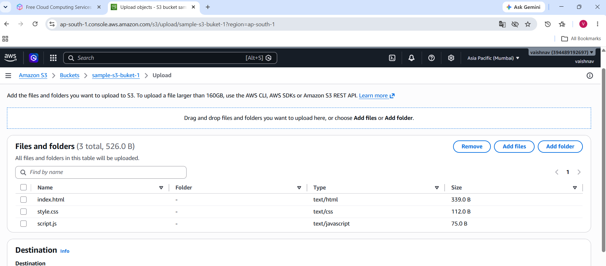
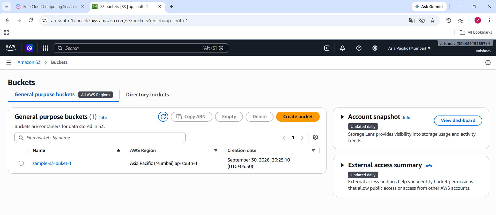
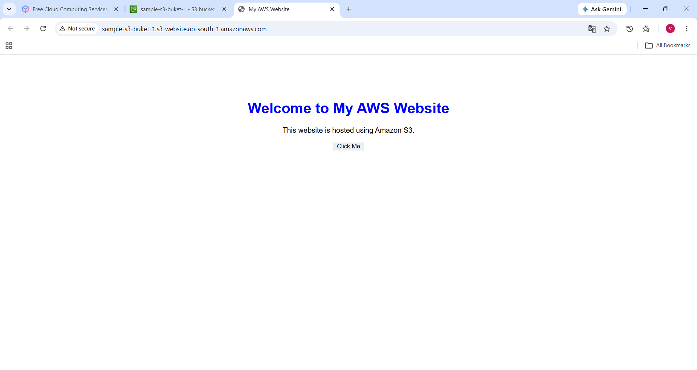

# AWS S3 Static Website Hosting

## 📌 Project Overview

This project demonstrates how to design, configure, and deploy a static website using **Amazon S3**.

The website is created using **HTML, CSS, and JavaScript** and hosted using **Amazon S3 Static Website Hosting**.

---

## 🎯 Project Objective

The main objective of this project is to understand how a static website can be hosted on AWS S3 and accessed through an S3 website endpoint.

---

## 🛠️ Technologies Used

- HTML5
- CSS3
- JavaScript
- Amazon S3
- AWS Bucket Policy
- VS Code
- GitHub

---

## 📁 Project Structure

│
├── index.html
├── style.css
├── script.js
├── images/
│   ├── s3-bucket.png
│   ├── upload-files.png
│   └── website.png
└── README.md

## 📸 Screenshots

### uploaded file

### s3 buket

### Working Website

